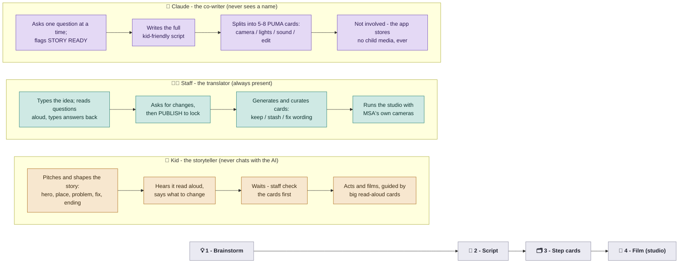

# MSA Script Builder

A tool that helps kids at [Märchen Sagen Academy](https://www.marchensagen.org) get from
"vague story idea in my head" to "locked script ready to shoot" — with staff guiding and
Claude doing the heavy lifting. Built by Luca De Winne for his Claude Corps application.

## The problem

Kids can imagine ambitious movies. What stops them isn't creativity — it's getting from a vague
idea to a plan they can actually shoot: holding every step in your head at once. **That's executive functioning, and for a kid with ADHD it's a
wall.** I hit that wall here as a ten-year-old — reading
and writing felt impossible, but *making* things did not. Years later I came back to teach, and
watched the next kids hit the same wall: not a lack of imagination, but the barrier of breaking a
big project into pieces that don't feel like drowning. So I built the tool I wish I'd had — it
carries the planning, sequencing, and what-comes-next, so kids keep the part that's theirs:
imagining, telling, and performing.

## ⭐ Start here

**[SPEC.md](SPEC.md) is the current spec — the source of truth for what gets built.**
It describes the four-phase model: 💡 Brainstorm → 📝 Script → 🗂️ Step cards → 🎥 Film.

## How it works (at a glance)

Three roles — **kid, staff, and Claude** — move a story through four phases. The app covers
the first three; filming happens in the real studio.

📊 **[Open the full-page process map →](https://lucadewinne-bit.github.io/msa-director-project/)**

**Non-negotiable:** staff-mediated only, zero child data (no names, photos, video, audio, or
accounts), and the app never records or stores any child's media.

## Run it locally

Needs Python 3 and the `anthropic` package (`pip3 install anthropic`).

1. Put an Anthropic API key in `api_key.txt` at the repo root (gitignored). Without a
   key it runs in a free "practice mode" with canned replies — handy for UI work.
2. `python3 app/server.py`
3. Open http://localhost:8000

## Deploy

Live on Vercel. `api/chat.py` is a serverless function that serves the page and proxies
the Anthropic API; the key lives only in the `ANTHROPIC_API_KEY` env var, never in the
repo. See [DECISIONS.md](DECISIONS.md) #6.

## The other files

| File | What it is |
|------|------------|
| [SPEC.md](SPEC.md) | **The current spec (V1). Work from this.** |
| [MASTER_PLAN.md](MASTER_PLAN.md) | The living plan with the status board |
| [DECISIONS.md](DECISIONS.md) | Every real decision, logged with reasoning |
| [REQUIREMENTS.md](REQUIREMENTS.md) | What the application requires |
| [VISION.md](VISION.md) | The long-term dream (parked until after July 17) |
| [PROMPT_ONBOARDING.md](PROMPT_ONBOARDING.md) | The engineer prompt that drove the onboarding round |
| [PHASE1_PROMPT.md](PHASE1_PROMPT.md) / [VALIDATION_PROMPT.md](VALIDATION_PROMPT.md) | The prompts that drove the research and spec phases |
| [directors-assistant-sketch.jsx](directors-assistant-sketch.jsx) | Early throwaway concept sketch (pre-pivot) |

## Credits & inspiration

The storytelling approach inside the tool — tell the truth, tell it with a
story, tell it with pictures, and the PUMA structure (head, spine, legs,
tail) — is inspired by Dan Roam's book *Show and Tell: How Everybody Can Make
Extraordinary Presentations*. Concepts adapted in our own words for kids'
filmmaking; no text or artwork from the book is reproduced here. Go buy it,
it's great.

## The process

This project is spec-driven on purpose: research → jobs-to-be-done → options → decision →
spec → build. The commit history shows the iterations, including the pivot from a
"step-by-step assistant" concept to the voice-first Script Builder. The evolution is
the point — see DECISIONS.md.
